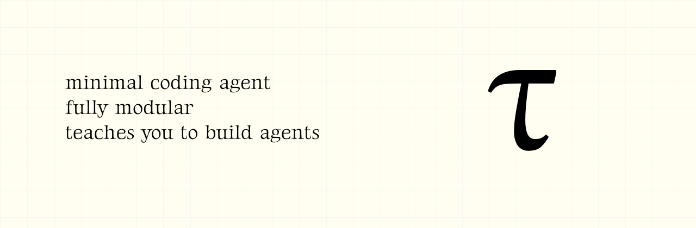

<p align="center">
  
</p>

<p align="center">
  <strong>A small, readable terminal coding agent — and a working example of how coding agents are built.</strong>
</p>

<p align="center">
  <a href="https://github.com/biggs-100/tau-biggz">GitHub</a>
  ·
  <a href="https://pypi.org/project/tau-biggz/">PyPI</a>
  ·
  <a href="https://github.com/biggs-100/tau-biggz/issues">Issues</a>
</p>

---

## What is Tau?

**Tau is a coding agent that lives in your terminal.** You type requests like
"explain this repo", "add tests", or "fix this stack trace"; Tau can read files,
edit code, run commands, and keep a durable session history while streaming what
it is doing.

Tau is also meant to be read. It is a teaching project for understanding the
shape of a coding-agent system without starting from a giant production
codebase.

```text
tau_coding  →  tau_agent  →  tau_ai
```

- `tau_ai` translates model providers into Tau's provider-neutral stream.
- `tau_agent` owns the portable brain: messages, tools, events, loop, harness,
  and session primitives.
- `tau_coding` wraps the brain as a real coding app: CLI, TUI, file/shell tools,
  provider config, project instructions, skills, and on-disk sessions.

The important boundary is:

```text
AgentHarness = reusable brain
CodingSession = coding-agent environment
TUI = one possible frontend
```

The core does not know about Textual, Rich, local config paths, slash commands,
or rendering. Frontends consume events.

## Install

Tau is published on PyPI as `tau-biggz` and installs a `tau` command.
It requires **Python 3.12 or newer**.

### Install with uv (recommended)

```bash
uv tool install tau-biggz
tau --version
```

Don't have `uv`? Install it first:

```bash
curl -LsSf https://astral.sh/uv/install.sh | sh
```

### Install with pipx

```bash
pipx install tau-biggz
```

### Install with pip

```bash
python -m pip install tau-biggz
```

### One-command install script

Linux / macOS:

```bash
curl -fsSL https://raw.githubusercontent.com/biggs-100/tau-biggz/main/install.sh | sh
```

Windows (PowerShell):

```powershell
irm https://raw.githubusercontent.com/biggs-100/tau-biggz/main/install.ps1 | iex
```

The script detects your Python, installs with pip, and adds `tau` to your PATH
if needed.

### Install from source (local development)

```bash
git clone https://github.com/biggs-100/tau-biggz.git
cd tau-biggz
uv sync --dev
uv run tau --version
```

Or install the local checkout as a regular package:

```bash
pip install .
# or
uv tool install --reinstall .
```

---

### Update / Upgrade

**From PyPI** (latest published version):

```bash
# With uv tool
uv tool upgrade tau-biggz

# With pip
python -m pip install --upgrade tau-biggz

# With pipx
pipx upgrade tau-biggz
```

**From source** (after `git pull`):

```bash
pip install --upgrade .
# or
uv tool install --reinstall .
```

The install scripts always pull the latest version, so you can re-run them:

```bash
curl -fsSL https://raw.githubusercontent.com/biggs-100/tau-biggz/main/install.sh | sh
```

---

### Uninstall

```bash
# If installed with uv tool
uv tool uninstall tau-biggz

# If installed with pip
python -m pip uninstall tau-biggz

# If installed with pipx
pipx uninstall tau-biggz
```

All methods remove the `tau` command and the tau-biggz package from your system.
Session history and configuration under `~/.tau/` are preserved — delete that
directory manually if you want a full cleanup.

## Quickstart

Run Tau from the project you want it to work on:

```bash
cd my-project
tau
```

Then type a request and press **Enter**:

```text
explain what this project does
```

One-shot print mode is useful for scripts and quick prompts:

```bash
tau -p "summarize the architecture"
tau --cwd /path/to/project -p "find the CLI entry point"
```

Tau needs a model provider. Start Tau and connect one with `/login`:

```bash
tau
```

```text
/login
/login openai
/login openai-codex
/model
```

Tau ships with support for OpenAI, Anthropic, OpenAI Codex subscription auth,
OpenRouter, Hugging Face, and custom OpenAI-compatible endpoints, including local
models. See the [providers guide](website/content/guides/providers-and-models.md).

The built-in catalog lives in `src/tau_coding/data/catalog.toml`; add your own
providers and models by dropping a `~/.tau/catalog.toml` with the same schema —
no code changes required.

## What Tau can do

- Interactive Textual TUI and non-interactive print mode.
- Built-in coding tools: `read`, `write`, `edit`, and `bash`.
- Durable JSONL sessions under `~/.tau/sessions/` with resume and branching.
- Slash commands for login, model selection, sessions, compaction, export, theme,
  trust, and more.
- Project instructions from `AGENTS.md`, `.tau/`, and `.agents/` resources.
- User skills and prompt templates.
- Context accounting, manual compaction, and optional automatic compaction.
- Provider-neutral event rendering for Rich, plain text, JSON, transcripts, and
  custom frontends.
- `--offline` flag to skip network calls on startup.
- `--rpc` mode for non-Python integrations (JSONL over stdin/stdout).
- `--harness` / `--list-harnesses` for loading and listing agent harnesses.
- `tau models sync` to sync model metadata from the model registry.
- `tau package` to install, list, and remove community packages.

## Philosophy

Tau follows a few rules:

- **Small layers beat magic.** Each package has one job and can be read alone.
- **Events are the contract.** Providers, renderers, the TUI, and custom
  frontends meet at a typed event stream.
- **The core stays portable.** The reusable harness does not depend on the CLI,
  Textual, Rich, or Tau's file layout.
- **Tools are ordinary typed functions.** A tool is a schema plus an async
  executor returning a structured result.
- **Sessions are durable and inspectable.** History is append-only JSONL; active
  context can be compacted without rewriting the record.
- **Documentation follows implementation.** The public docs explain the result;
  `dev-notes/` preserves the phase-by-phase build journal.

## Use Tau as a library

```python
from tau_agent import AgentHarness, AgentHarnessConfig

harness = AgentHarness(
    AgentHarnessConfig(
        provider=provider,
        model="my-model",
        system="You are a helpful coding agent.",
        tools=tools,
    )
)

async for event in harness.prompt("Explain this package"):
    print(event)
```

Because the harness emits events instead of rendering UI directly, the same core
can drive the built-in TUI, print mode, or a frontend you build yourself.

## Development

See [CONTRIBUTING.md](CONTRIBUTING.md) for project philosophy, layer boundaries, testing expectations, and pull request guidelines.

```bash
uv sync --dev
uv run pytest
uv run ruff check .
uv run ruff format --check .
uv run mypy
```

Run Tau from the checkout:

```bash
uv run tau
uv run tau -p "explain this repo"
```

Run the Hugo documentation site:

```bash
cd website
hugo server -D
```

Open <http://localhost:1313/>. Build with `hugo --minify`.

## Documentation

User docs live in `website/content/`. Build and view them locally:

```bash
cd website
hugo server -D
```

Useful entry points:

- [What is Tau?](website/content/what-is-tau.md)
- [Quickstart](website/content/quickstart.md)
- [Core concepts](website/content/concepts.md)
- [Architecture overview](website/content/internals/architecture.md)
- [The agent loop & events](website/content/internals/agent-loop.md)
- [CLI reference](website/content/reference/cli.md)

Tau is under active development. The implementation roadmap is tracked in
[GitHub issues](https://github.com/biggs-100/tau-biggz/issues).

## License

Tau is released under the [MIT License](LICENSE).
